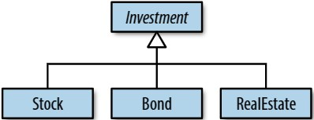
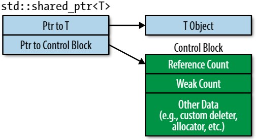

- [Chapter 4 智能指针](#chapter-4-智能指针)
  - [Item 18 对于 _exclusive-ownership_ 的资源管理使用 _std::unique\_ptr_](#item-18-对于-exclusive-ownership-的资源管理使用-stdunique_ptr)
    - [需要记住的规则](#需要记住的规则)
  - [Item 19 对于 _shared-ownership_ 的资源管理使用 _std::shared\_ptr_](#item-19-对于-shared-ownership-的资源管理使用-stdshared_ptr)
    - [需要记住的规则](#需要记住的规则-1)

# Chapter 4 智能指针

诗人和作曲家都对爱情情有独钟，有时候也对计数情有独钟。偶尔两者都有。受到 _Elizabeth Barrett Browning_ 的  
**_How do I love thee? Let me count the ways._** 和 _Paul Simon_ 的 **_There must be 50 ways to leave your lover._** 在爱与  
计数方面不同观点的启发，我们可以试着去列举原始指针很难被喜欢的原因：  
* 原始指针的声明不会表明这个原始指针是指向单个对象还是一组对象。
* 原始指针的声明没有透露：当你使用完这个原始指针的时候，你是否应该销毁这个原始指针所指向的内容，即  
为：这个原始指针是否 **_拥有_** 它所指向的内容。
* 如果你确定应该销毁原始指针所指向的内容的话，那么是没有方法告诉你应该如何进行的。应该使用 _delete_  
还是应该使用不同的析构机制呢？比如：应该将原始指针传入到一个专用的析构函数中。
* 如果你发现了 _delete_ 是合适的方法的话，那么也可能并不知道应该使用 _delete_ 还是应该使用 _delete[]_ 呢？如  
果你使用了错误的格式的话，那么结果是未定义的。
* 假设你确定：原始指针拥有它所指向的内容，而且你知道了应该如何销毁它，但还是很难去沿着你代码的每一  
条路径和这些路径所导致的异常，去确定只执行了一次析构。错过一条路径会导致资源泄露，而多执行一次析  
构则会导致 _undefined behavior_。
* 通常没有方法可以表明原始指针是否悬空了，即为：原始指针所指向的内存不再保存它应该指向的对象了。当  
对象被销毁，而原始指针仍然指向这个对象时，悬空指针就产生了。

原始指针是强大的工具，这是可以肯定的，但是数十年的经验已经证明：只要在专注和纪律中有一点小疏忽，这些  
工具可以反过来攻击使用它的人。

智能指针是解决这些问题的一种方法。智能指针是原始指针的包装，它表现的非常像它所包装的那个原始指针，而  
且它还可以避免很多原始指针的陷阱。因此，应该首选智能指针而不是原始指针。智能指针几乎可以做原始指针可  
以做的所有事，并且出错的机会要少的多。

_C++11_ 有 _4_ 种智能指针：_std::auto_ptr_、_std::unique_ptr_ 、_std::shared_ptr_ 和 _std::weak_ptr_。它们是被设计来帮助管  
理动态分配的对象的生命周期的，即为：通过确认这些对象是在合适的时间以合适的方式被销毁来避免资源泄露,  
包括在异常事件中。 

_std::auto_ptr_ 是 _C++98_ 遗留下来的一个被废弃的类型，它是对后来成为标准化 _C++11_ 的 _std::unique_ptr_ 的尝试。  
想要正确的完成这个工作是需要移动语义的，但是 _C++98_ 并没有移动语义。做为一种解决方法，_std::auto_ptr_ 利  
用了它的 _copy operation_ 来完成移动操作。这会产生令人惊讶的代码：拷贝 _std::auto_ptr_ 会将它设置为空，这也会  
导致令人沮丧的使用限制，比如：不能在 _container_ 中存储 _std::auto_ptr_ 类型的对象。

_std::unique_ptr_ 可以做 _std::auto_ptr_ 可以做的所有事情，而且更多。_std::unique_ptr_ 可以高效率地完成工作，而且是  
在不改变复制对象含义的情况下完成的工作。无论哪个方面，_std::unique_ptr_ 都比 _std::auto_ptr_ 要好。 唯一合理的  
使用 _std::auto_ptr_ 的场景是需要使用 _C++98_ 编译器来编译代码。除非有这种限制，否则应该使用 _std::unique_ptr_   
来代替 _std::auto_ptr_，并且永不再用 _std::auto_ptr_。

智能指针的 _API_ 多种多样。唯一对于所有的智能指针都共有的功能是默认构造。因为这些 _API_ 所对应的全面的参  
考文档非常地多，所以我将专注于讨论那些通常在 _API_ 的概述中所没有的信息，比如，值得使用的场景和运行成  
本分析等等。掌握这些信息会让你从只会使用智能指针变为高效使用智能指针。

## Item 18 对于 _exclusive-ownership_ 的资源管理使用 _std::unique_ptr_

当你接触到智能指针时，_std::unique_ptr_ 通常应该是首选。默认情况下，有理由去假设： _std::unique_ptr_ 和原始指  
针是一样大的，并且对于大多数操作来说，包括解引用，它们执行的都是相同的指令。这意味着即使在内存和周期  
都很紧张的情况下也可以使用 _std::unique_ptr_。如果原始指针对于你来说是足够小和快的话，那么 _std::unique_ptr_  
几乎也可以确定是这样的。

_std::unique_ptr_ 体现了 _exclusive ownership_ 的语义。一个非空的 _std::unique_ptr_ 总是拥有着它所指向的内容。移动   
_std::unique_ptr_ 会将 _ownership_ 从源指针转移到目标指针中，源指针会被设置为空。而拷贝 _std::unique_ptr_ 是不被  
允许的，因为如果你可以拷贝的话，那么你最终将有两个指向相同资源的 _std::unique_ptr_，而且每一个都认为自己  
拥有着这个资源且应该自己去销毁这个资源。因此，_std::unique_ptr_ 是 _move-only_ 类型。一旦发生析构时，非空的  
_std::unique_ptr_ 应该去销毁它的资源。默认情况下，资源析构是通过在 _std::unique_ptr_ 内应用 _delete_ 到原始指针来  
完成的。

一个对于 _std::unique_ptr_ 的常见用法是做为层级结构中的对象的工厂函数的返回类型。假设我们有一个关于投资类  
型的层级结构，比如：股票、债券、房地产等，使用的 _base class
_ 是 _Investment_。  
```C++
  class Investment { … };
  
  class Stock:
    public Investment { … };
  
  class Bond:
    public Investment { … };
  
  class RealEstate:
    public Investment { … };
```

  

这个层级结构的工厂函数一般会在堆上分配一个对象，并返回一个指向这个对象的指针，当不再需要这个对象时，  
调用方负责去删除这个对象。这是 _std::unique_ptr_ 的完美匹配，因为调用方承担了工厂函数所返回的资源的责任，  
即为：_exclusive ownership_，当 _std::unique_ptr_ 被销毁时，_std::unique_ptr_ 会自动删除它所指向的对象。_Investment_  
的层级结构的工厂函数被声明为下面这样：
```C++
  template<typename... Ts>              // return std::unique_ptr
  std::unique_ptr<Investment>           // to an object created
  makeInvestment(Ts&&... params);       // from the given args
```  

调用方可以像下面这样在单一作用域内使用返回的 _std::unique_ptr_：  
```C++
  {
    …

    auto pInvestment =                  // pInvestment is of type
      makeInvestment( arguments );      // std::unique_ptr<Investment>
    
    …
}
```  
但是也可以在 _ownership-migration_ 的情景下使用它，比如：将工厂函数所返回的 _std::unique_ptr_ 移动到 _container_   
中，随后又将 _container_ 中的这个 _std::unique_ptr_ 移动到某个对象的数据成员中，最后这个对象被销毁。当这种情  
况发生时，这个对象的 _std::unique_ptr_ 数据成员也是会被销毁，_std::unique_ptr_ 的析构函数会导致工厂函数返回的  
资源被销毁。如果 _ownership_ 链条由于异常或者其他非典型的控制流程而中断了，比如：提前结束函数或者中断循  
环，拥有所管理的资源的 _std::unique_ptr_ 最终还是会调用到它的析构函数，这会将正在管理的资源销毁掉。

默认情况下，析构是通过 _delete_ 来进行的，但是也可以在构造期间使用 _custom deleter_ 来对 _std::unique_ptr_ 对象进  
行配置：当到了要销毁资源的时候，这些任意的函数或函数对象，包括 _lambda expression_ 所产生的 _closure_，会被  
执行。如果 _makeInvestment_ 所创建的对象不应该直接被直接被删除，而是应该先写一个 _log_ 的话，那么可以向下  
面这样来实现  _makeInvestment_ ，代码后面跟着解释，所以当你看到一些事情的意图不太明显时，不要担心：  
```C++
  auto delInvmt = [](Investment* pInvestment)               // custom
  {                                                         // deleter
    makeLogEntry(pInvestment);                              // (a lambda
    delete pInvestment;                                     // expression)
  };

  template<typename... Ts>                                  // revised
  std::unique_ptr<Investment, decltype(delInvmt)>           // return type
  makeInvestment(Ts&&... params)
  {
    std::unique_ptr<Investment, decltype(delInvmt)>         // ptr to be
      pInv(nullptr, delInvmt);                              // returned

    if ( /* a Stock object should be created */ )
    {
      pInv.reset(new Stock(std::forward<Ts>(params)...));
    }
    else if ( /* a Bond object should be created */ )
    {
      pInv.reset(new Bond(std::forward<Ts>(params)...));
    }
    else if ( /* a RealEstate object should be created */ )
    {
      pInv.reset(new RealEstate(std::forward<Ts>(params)...));
    }
    return pInv;
  }
```   
 稍后，我会解释这些是如何工作的，但是我们先来考虑一下：如果你是调用方的话，那么事情会是怎样的。假设你  
 将 _makeInvestment_ 的结果存储到了 _auto_ 变量中，你是可以忽略你所使用的资源是需要在删除期间被特殊对待的  
 事实的。事实上，你该高兴，因为使用 _std::unique_ptr_ 意味着：不需要关心资源应该何时被销毁，更不用去确保在  
 程序中的每条路径上只发生了一次析构。_std::unique_ptr_ 会自动处理这些事情。站在客户的角度，_makeInvestment_   
 的接口是完美的。

一旦你理解了以下内容，这个实现也是非常好的：  

* _delInvmt_ 是 _makeInvestment_ 所返回的对象所对应的 _custom deleter_。所有的 _custom deleter_ 都接收一个指向  
了会被销毁的对象的原始指针，会去做一些要销毁这个对象所必须要做的动作。在这个场景中，这个所对应的  
动作是调  _makeLogEntry_，然后应用 _delete_。使用 _lambda expression_ 去创建 _delInvmt_ 是方便的，而且正如我  
们很快会看到的，使用 _lambda expression_ 比使用常规的函数是要高效的。
* 当一个 _custom deleter_ 被使用时，它的类型是被用来做为 _std::unique_ptr_ 的第二个类型实参的。在这个场景中，  
是 _delInvmt_ 的类型，_makeInvestment_ 所返回的类型必须是 _std::unique_ptr&lt;Investment, decltype(delInvmt)&gt;_。  
更多关于 _decltype_ 的信息见  [_Item 3_](./Chapter%201.md#item-3-理解-decltype)。
* _makeInvestment_ 的基本策略是创建一个空的 _std::unique_ptr_ 并使它指向一个合适类型的对象，然后再返回这个  
_std::unique_ptr_。为了将 _custom deleter_ _delInvmt_ 与 _pInv_ 关联起来，我们将 _delInvmt_ 来做为 _std::unique_ptr_ 的  
构造函数的第二个实参。
* 尝试将从 _new_ 得来的原始指针赋值给 _std::unique_ptr_ 是不能通过编译的，因为这将被视为从原始指针到智能  
指针的隐式转换。这样的隐式转换是有问题的，所以 _C++11_ 的智能指针禁止了这种转换。这也是为什么需要  
使用 _reset_ 来让 _pInv_ 获取到通过 _new_ 所创建的对象的 _ownership_。
* 在每次使用 _new_ 时，我们都使用 _std::forward_ 来完美转发所传递给 _makeInvestment_ 的实参，见 [_Item 25_](./Chapter%205.md#item-25-std::move-用于右值引用-std::forward-用于-univeral-reference)。这  
使得所创建的对象的构造函数可以获取到调用方所提供的全部信息。
* _custom deleter_ 持有一个 _Investment*_ 类型的形参。不管在 _makeInvestment_ 中所创建的对象的类型是什么，即  
为：_Stock_、_Bond_ 或 _RealEstate_，最终在 _lambda expression_ 中都是做为一个 _Investment*_ 对象来删除的。这意  
味着我们可以通过 _base class_ 指针来删除 _derived class_ 对象。为了可以这样，_base class_ _Investment_ 必须有一个 _virtual_ 析构函数：
```C++
  class Investment {
    public:
    …                         // essential
    virtual ~Investment();    // design
    …                         // component!
  };
```

在 _C++14_ 中，函数返回值类型推导的存在，见 [_Item 3_](./Chapter%201.md#item-3-理解-decltype)，意味着 _makeInvestment_ 可以以更简洁和更好封装的形式  
来实现：  
```C++
  template<typename... Ts>
  auto makeInvestment(Ts&&... params)             // C++14
  {
    auto delInvmt = [](Investment* pInvestment)             // this is now
    {                                                       // inside
      makeLogEntry(pInvestment);                            // make-
      delete pInvestment;                                   // Investment
    };

    std::unique_ptr<Investment, decltype(delInvmt)>         // as
      pInv(nullptr, delInvmt);                              // before
    
    if ( … )                                                // as before
    {
      pInv.reset(new Stock(std::forward<Ts>(params)...));
    }
    else if ( … )                                           // as before
    {
      pInv.reset(new Bond(std::forward<Ts>(params)...));
    }
    else if ( … )                                           // as before
    {
      pInv.reset(new RealEstate(std::forward<Ts>(params)...));
    }
    
    return pInv;                                            // as before
  }
```  

我之前就提到过，当使用 _default deleter_ 时，即为 _delete_，你有理由假设 _std::unique_ptr_ 和原始指针是一样大的。  
当 _custom deleter_ 参与进来时，可能就不是这样了。当 _deleter_ 是函数指针时，通常会导致 _std::unique_ptr_ 的大小  
由一个字增长为两个字。而对于 _deleter_ 是函数对象的情况，大小的改变依赖于有多少种状态存储在函数对象中。  
无状态的函数对象，比如没有捕获的 _lambda expression_，不会改变大小，这意味着：当 _custom deleter_ 的实现可  
以由函数或无捕获的 _lambda expression_ 来实现时，_lambda expression_ 是更好的选择：
```C++
  auto delInvmt1 = [](Investment* pInvestment)    // custom
  {                                               // deleter
    makeLogEntry(pInvestment);                    // as
    delete pInvestment;                           // stateless
  };                                              // lambda
  
  template<typename... Ts>                        // return type
  std::unique_ptr<Investment, decltype(delInvmt1)>// has size of
  makeInvestment(Ts&&... args);                   // Investment*
  
  void delInvmt2(Investment* pInvestment)         // custom
  {                                               // deleter
    makeLogEntry(pInvestment);                    // as function
    delete pInvestment;
  }
  
  template<typename... Ts>                        // return type has
  std::unique_ptr<Investment,                     // size of Investment*
                  void (*)(Investment*)>          // plus at least size
  makeInvestment(Ts&&... params);                 // of function pointer!
```  

具有大量状态的函数对象 _deleter_ 可以产生显著增大的 _std::unique_ptr_ 对象。如果你发现了 _custom deleter_ 使你的  
_std::unique_ptr_ 变的大到不可接受了的话，那么你大概需要去改变你的设计了。

工厂函数并不是 _std::unique_ptr_ 唯一常见的使用场景。工厂函数更常见的是做为实现 _Pimpl Idiom_ 的机制。工厂函  
数实现 _Pimpl Idiom_ 的代码并不复杂，只是在一些场景中，没有那么直观，所以，我推荐你去看 [_Item 22_](./Chapter%204.md#item-22-首选-std::make_unique-和-std::make_shared-而不是直接使用-new)，其中专  
门描述了这个话题。

_std::unique_ptr_ 有两种形式：_std::unique_ptr&lt;T&gt;_ 对应于单个对象，而 _std::unique_ptr&lt;T[]&gt;_ 对应于数组对象。总  
之，对于 _std::unique_ptr_ 所指向的实体永远不会有任何歧义。_std::unique_ptr_ 的 _API_ 是被设计成与你正在使用的形  
式相匹配的。例如：对于单个对象的形式是没有 _operator[]_ 的，而对于数组形式是缺少 _operator*_ 和 _operator->_   
的。

对于数组形式的 _std::unique_ptr_，你只需要知道它是存在的就可以了。因为 _std::array_、_std::vector_ 和 _std::string_ 相  
比于原始数组几乎总是更好的数据结构选择。只有一种我可以想到的情况：当你正在使用一个会返回指向堆数组的  
原始指针的 _C-like_ 的 _API_，并且你拥有这个堆数组的所有权时，再去使用 _std::unique_ptr&lt;T[]&gt;_ 才能说的通。

_std::unique_ptr_ 是 _C++11_ 表达 _exclusive ownership_ 的方法，但是它还有一个最吸引人的特性：_std::unique_ptr_ 可以  
被简单高效地转换为 _std::shared_ptr_：
```C++
  std::shared_ptr<Investment> sp =      // converts std::unique_ptr
  makeInvestment( arguments );          // to std::shared_ptr
```  
这个特性使得 _std::unique_ptr_ 非常适合做为工厂函数的返回类型。对于工厂函数所返回的对象来说，它们并不知道  
调用方会使用 _exclusive ownership_ 语义还是 _shared ownership_ 语义，即为：_std::shared_ptr_ 是否会更合适。通过返  
回 _std::unique_ptr_，工厂函数只是提供给了调用方一个高效的智能指针，但并不会阻碍调用方使用更灵活的其他智   
能指针来代替它。更多关于 _std::shared_ptr_ 的信息见  [_Item 19_](./Chapter%204.md#item-19-对于-shared-ownership-的资源管理使用-std::shared_ptr)。

### 需要记住的规则

* _std::unique_ptr_ 是小的、快的和 _move-only_ 的智能指针，用于使用 _exclusive-ownership_ 语义来管理资源。
* 资源析构默认是通过 _delete_ 来进行的，但是也可以指定 _custom deleters_。带状态的 _stateful deleter_ 和函数指  
针做为 _deleter_ 时，会增加 _std::unique_ptr_ 对象的大小。
* 转换 _std::unique_ptr_ 为 _std::shared_ptr_ 是容易的。  

## Item 19 对于 _shared-ownership_ 的资源管理使用 _std::shared_ptr_

那些使用具有垃圾回收的语言的程序员会指着嘲笑 _C++_ 程序员为了避免资源泄露所做的一切。他们会嘲笑：“太原  
始了!”，“你们难道没有收到 _1960_ 年代 _Lisp_ 的备忘录吗？机器应该管理资源的生命周期，而不是人类。” _C++_ 开发  
者会翻翻白眼说 “只有内存是资源吗？而且你们的资源的回收时机还是不确定的。我们更喜欢析构函数的通用性和  
可预测性。谢谢你！”但是我们的勇气中有点虚张声势的成分。垃圾回收真的是方便的，手动管理生命周期真的就像是在使用石刀和熊皮来构建一个记忆内存电路。为什么我们不可以同时拥有两者呢?：一个自动运行的系统，类  
似于垃圾回收，而且它仍然适用于所有的资源且有可预测的时机，类似于析构函数。

_C++11_ 的 _std::shared_ptr_ 将两者绑定在了一起。通过 _std::shared_ptr_ 所访问的对象的生命周期是由 _std::shared_ptr_  
通过 _shared ownership_ 来进行管理的。不是特定的哪一个 _std::shared_ptr_ 会拥有这个对象。相反地是，所有的指向  
这个对象的 _std::shared_ptr_ 都拥有这个对象，它们会相互协作来确保当这个对象不再被需要时再销毁它。当最后一  
个指向某个对象的 _std::shared_ptr_ 不再被使用时，比如：因为 _std::shared_ptr_ 被销毁或者被指向了另一个对象时， 
_std::shared_ptr_ 会销毁它所指向的那个对象。正如使用垃圾回收一样，客户不需要自己关心所指向的对象的生命周  
期的管理，而且就像使用析构函数一样，对象的析构操作的时机是确定的。

_std::shared_ptr_ 可以通过查询资源的引用计数来知道它是否是最后一个指向所对应资源的 _std::shared_ptr_，资源的引  
用计数是一个值，它表明了有多少个 _std::shared_ptr_ 指向了这个资源。_std::shared_ptr_ 的构造函数 **_通常_** 都会增加引  
用计数，_std::shared_ptr_ 的析构函数会减少引用计数，而 _std::shared_ptr_ 的 _copy assignment operators_ 会同时增加  
和减少引用计数。如果 _sp1_ 和 _sp2_ 是指向不同对象的 _std::shared_ptr_ 的话，那么 _sp1 = sp2;_ 会更改 _sp1_，因为 _sp1_  
现在指向 _sp2_ 所指向的对象了。这个操作的结果是 _sp1_ 原先指向的对象的引用计数会减少，而 _sp2_ 所指向的对象  
的引用计数会增加。如果 _std::shared_ptr_ 在执行一次减少操作后，看到了引用计数成为 _0_ 了的话，那么就是已经没  
有 _std::shared_ptr_ 指向这个资源了，所以 _std::shared_ptr_ 会去销毁这个资源。

引用计数的存在会带来性能影响：  
* _std::shared_ptr_ 是原始指针的两倍大小，因为它内部包含了指向资源的原始指针和指向资源的引用计数的原始  
指针。
* 引用计数的内存必须被动态分配。在概念上，引用计数是和所指向的对象相关的，但是所指向的对象是不知道  
这些的。因此，所指向的对象是没有地方去存储引用计数的，令人愉快的是：任何的对象，甚至是那些内建类  
型的对象，都可以被 _std::shared_ptr_ 所管理。[_Item 21_](./Chapter%204.md#item-21-首选-std::make-unique-和-std::make-shared-而不是直接使用-new) 解释了：当 _std::shared_ptr_ 是被 _std::make_shared_ 所创建  
时，动态分配的成本是可以被避免的。但是 _std::make_shared_ 不可以在一些场景中使用。不管怎样，引用计数  
是做为动态分配的数据来存储的。
* 引用计数的增加和减少必须是原子的，因为在不同线程中可以同时进行读写。例如：在一个线程中，指向某个  
资源的 _std::shared_ptr_ 可以执行它的的析构函数，这可以减少它所指向的资源的引用计数，而在另一个线程中，  
指向同一个资源的 _std::shared_ptr_ 可以被拷贝，这可以增加它所指向的资源的引用计数。原子操作一般比非原  
子操作要慢，所以尽管引用计数通常只有一个字的大小，但你仍然应该假设读写引用计数的成本是相对大的。

当我写下 _std::shared_ptr_ 的构造函数只是 **_通常_** 会增加它所指向的对象的引用计数时，是否有激起你的好奇心呢？  
创建一个指向一个对象的 _std::shared_ptr_ 总是会产生另一个指向同一个对象的 _std::shared_ptr_，那为什么不是 **_总是_**  
增加引用计数呢？

是因为移动操作。移动构造新的 _std::shared_ptr_ 会使旧的 _std::shared_ptr_ 指向空，这意味着，在新的 _std::shared_ptr_  
开始时，旧的 _std::shared_ptr_ 就不再指向资源了。因此，不需要对引用计数进行操作。移动 _std::shared_ptr_ 是比拷  
贝 _std::shared_ptr_ 要快的：拷贝需要增加引用计数，而移动则不需要。构造和赋值都是这样，_move constructor_ 是  
比 _copy constructor_ 快的，_move assignment operator_ 是比 _copy assignment operator_ 快的。

就像 _std::unique_ptr_ 一样，见 [_Item 18_](./Chapter%204.md#item-18-对于-exclusive-ownership-的资源管理使用-stdunique_ptr)，_std::shared_ptr_ 也会使用 _delete_ 做它的默认的资源析构机制，但也是支持   
_custom deleter_ 的。然而，_std::shared_ptr_ 所支持的设计和 _std::unique_ptr_ 所支持的设计是不同的。_std::unique_ptr_  
所对应的 _deleter_ 的类型是智能指针的类型的一部分，而 _std::shared_ptr_ 却不是这样的：  
```C++
  auto loggingDel = [](Widget *pw)      // custom deleter
  {                                     // (as in Item 18)
    makeLogEntry(pw);
    delete pw;
  };

  std::unique_ptr<                      // deleter type is
    Widget, decltype(loggingDel)        // part of ptr type
    > upw(new Widget, loggingDel);

  std::shared_ptr<Widget>               // deleter type is not
    spw(new Widget, loggingDel);        // part of ptr type
```

_std::shared_ptr_ 的设计更加灵活。考虑两个 _std::shared_ptr&lt;Widget&gt;_，它们使用不同类的 _custom deleter_，比如：  
_custom deleter_ 是通过 _lambda expression_ 来指定的。
```C++
  auto customDeleter1 = [](Widget *pw) { … };     // custom deleters,
  auto customDeleter2 = [](Widget *pw) { … };     // each with a
                                                  // different type
  
  std::shared_ptr<Widget> pw1(new Widget, customDeleter1);
  std::shared_ptr<Widget> pw2(new Widget, customDeleter2);
```  
因为 _pw1_ 和 _pw2_ 有相同的类型，它们可以被放置在同一类的容器中：  
```C++
  std::vector<std::shared_ptr<Widget>> vpw{ pw1, pw2 };
```  
它们也可以相互赋值，它们都可以被传递给持有 _std::shared_ptr&lt;Widget&gt;_ 类型形参的函数。对于 _custom deleters_  
的类型是不同的 _std::unique_ptr_ 来说，是不可以完成这些的，因为 _custom deleters_ 的类型会影响 _std::unique_ptr_ 的  
类型。

 另一个与 _std::unique_ptr_ 不同的地方是指定一个 _custom deleters_ 不会改变 _std::shared_ptr_ 对象的大小。不管是什么  
 样的 _deleter_，_std::shared_ptr_ 对象的总是两个指针那么大的。这是好消息，但是这应该会让你略感不安。这是因为  
 _custom deleters_ 可以是函数对象，而函数对象是可以包含任意数量的数据的。这意味着它可以是任意大小的。那么  
 _std::shared_ptr_ 是如何可以在没有使用更多的内存的情况下，而去引用任意大小的 _deleter_ 呢？

这是不可能的，必须要使用更多的内存。然而，这些内存不是 _std::shared_ptr_ 对象的一部分。这些内存是在堆上  
的，或者如果 _std::shared_ptr_ 的创建者有利用 _std::shared_ptr_ 对于 _custom allocators_ 的支持的话，那么这些内存是  
在这个 _allocator_ 所管理的内存的任意位置上的。我之前就有提到过，_std::shared_ptr_ 对象是包含有一个它所指向的  
对象的引用计数的指针的。这是正确的，但是却有点误导人，因为引用计数只是被称为是 _control block_ 的数据结  
构的一部分。对于每一个被 _std::shared_ptr_ 所管理的对象，都有一个所对应的 _control block_。除了引用计数外，如  
果 _custom deleters_ 被指定的了的话，那么 _control black_ 还会包含有这个 _custom deleters_ 副本。同样地还有，如果  
_allocator deleters_ 也被指定的了的话，那么 _control black_ 还会包含这个 _allocator deleters_ 副本。_control block_ 也可  
以包含额外的数据，像 [_Item 21_](./Chapter%204.md#item-21-首选-std::make-unique-和-std::make-shared-而不是直接使用-new) 解释的那样，包括被称为是 _weak count_ 的第二引用计数，但是我们在本 _Item_ 中先  
忽略这些数据。我们可以设想与 _std::shared_ptr&lt;T&gt;_ 对象相关的内存就像下面这样：  

  

一个对象的 _control block_ 是由创建第一个指向该对象的 _std::shared_ptr_ 的函数所设置的。至少应该这样的。通常，  
创建指向一个对象的 _std::shared_ptr_ 的函数是不可能知道是否有其他的 _std::shared_ptr_ 已经指向了这个对象的，所  
以下面的创建 _control block_ 的规则会被使用到：  

* _std::make_shared_，见 [_Item 21_](./Chapter%204.md#item-21-首选-std::make-unique-和-std::make-shared-而不是直接使用-new)，总是创建一个 _control block_。它会生成一个所指向的新对象，所以，当调用它  
时，这个新对象所对应的 _control block_ 肯定是不存在的。
* 当 _std::shared_ptr_ 是根据 _unique-ownership_ 的指针，即为：_std::unique_ptr_ 或 _std::auto_ptr_，所构造出的时，  
一个 _control block_ 就被创建了。_unique-ownership_ 的指针是不会使用 _control block_ 的，所以它们所指向的对  
象是不会有 _control block_ 的。做为 _std::shared_ptr_ 的构造函数的一部分，_std::shared_ptr_ 获取了所指向的对象  
的 _ownership_，而 _unique-ownership_ 的指针指向了空。
* 当使用原始指针来调用 _std::shared_ptr_ 的构造函数时，会创建 _control block_。如果根据已经有了 _control block_   
的对象来创建 _std::shared_ptr_ 的话，那么你需要做的是去传递一个 _std::shared_ptr_ 或 _std::weak_ptr_ 类型的对象  
来做为 _std::shared_ptr_ 的构造函数的实参，见 [_Item 20_](./Chapter%204.md#item-20-对于可能悬空的-std::shared_ptr-like-指针-使用-std::weak_ptr)，而不是去传递一个原始指针类型的对象来做为实参。  
当传递的是 _std::shared_ptr_ 或 _std::weak_ptr_ 类型的对象来做为 _std::shared_ptr_ 的构造函数的实参时，是不会  
创建 _control block_ 的，因为此时可以依赖所传入的智能指针所对应的 _control block_。

这些规则的结果是：根据单个原始指针构造多个 _std::shared_ptr_ 会让你免费搭载上 _undefined behavior_ 的粒子加速  
器，因为所指向的对象会有多个 _control block_。多个 _control block_ 意味着有多个引用计数，而多个引用计数意味着  
这个对象会被销毁多次，每个引用计数都会销毁一次。这意味着像这样的代码是非常糟糕的：
```C++
  auto pw = new Widget;                           // pw is raw ptr
  
  …
  
  std::shared_ptr<Widget> spw1(pw, loggingDel);   // create control
                                                  // block for *pw
  …

  std::shared_ptr<Widget> spw2(pw, loggingDel);   // create 2nd
                                                  // control block
                                                  // for *pw!
```  
创建指向动态分配的对象的原始指针 _pw_ 是糟糕的，因为这与本章的建议是背道而驰的：首选智能指针而不是原始  
指针。如果你已经忘记这个建议的意图的话，那么回顾下 [_Chapter 4_](./Chapter%204.md#chapter-4-智能指针)。但是先放在一边，创建 _pw_ 的那一行的风格  
是令人厌恶的，但是至少不会导致 _undefined behavior_。

现在，因为在调用 _spw1_ 的构造函数时使用了原始指针，所以这就为所指向的对象创建了一个 _control block_ ，也就  
是创建了一个引用计数。在这个场景中，所指向的对象是 _*pw_，即为：_pw_ 所指向的对象。这是可以的，但是因为  
在调用 _spw2_ 的构造函数时使用了相同的原始指针，所以这就为 _*pw_ 又创建了一个 _control block_ ，也就是又创建  
了一个引用计数。因此 _*pw_ 就有两个引用计数了，这两个引用计数都最终会变为 _0_，这最终会导致去销毁 _*pw_ 两  
次。第二次的析构操作会导致 _undefined behavior_。

此处至少有两个关于使用 _std::shared_ptr_ 的注意事项：首选，避免传递原始指针到 _std::shared_ptr_ 的构造函数中。  
常用的替代方法是去使用 _std::make_shared_，见 [_Item 21_](./Chapter%204.md#item-21-首选-std::make-unique-和-std::make-shared-而不是直接使用-new)，但在上面的例子中，我们使用了 _custom deleter_，这就不  
能使用 _std::make_shared_ 了。其次，如果你必须要传递一个原始指针到 _std::shared_ptr_ 的构造函数中的话，那么应  
该直接传递 _new_ 的结果来代替原始指针变量。如果上面的代码被重写成了下面这样：  
```C++
  std::shared_ptr<Widget> spw1(new Widget,        // direct use of new
                                loggingDel);
```  
这样就不会根据相同的原始指针来创建第二个 _std::shared_ptr_ 了。相反地是，创建 _spw2_ 的代码的作者会自然地以  
_spw1_ 来做为初始化实参，即为：将会调用 _std::shared_ptr_ 的拷贝构造函数，这不会造成任何问题：  
```C++
 std::shared_ptr<Widget> spw2(spw1);    // spw2 uses same
                                        // control block as spw1 
```  
使用原始指针来做为 _std::shared_ptr_ 的构造函数的实参是一个特别令人惊讶的方法，这可以导致多个 _control block_  
都牵涉到这个指针。假定我们的程序使用 _std::shared_ptr_ 来管理 _Widget_ 对象，
并且我们使用一个数据结构来追踪  
已经处理过的 _Widget_ 对象：  
```C++
  std::vector<std::shared_ptr<Widget>> processedWidgets;
```  
假定，_Winget_ 有一个成员函数来做这种处理：  
```C++
  class Widget {
  public:
    …
    void process();
    …
  };
```  
这是 _Widget::process_ 的一个看起来像是合理的方法：  
```C++
  void Widget::process()
  {
    …                                             // process the Widget
    
    processedWidgets.emplace_back(this);          // add it to list of
  }                                               // processed Widgets;
                                                  // this is wrong!
```  

关于错误，注释已经说明了一切，至少说明了大部分。错误是因为传递了 _this_，而不是使用了 _emplace_back_。如  
果你不熟悉 _emplace_back_ 的话，那么见 [_Item 42_](./Chapter%208.md#item-42-考虑使用-emplacement-来代替-insertion)。这个代码是可以编译的，但是却是将原始指针 _this_ 传递到到了   
_std::shared_ptr_ 的 _container_ 中。因此，所构造的 _std::shared_ptr_ 将会为 _*this_ 来创建一个新的 _control block_。这听  
起来好像没什么问题，直到你意识到：如果在成员函数外已经存在有了 _shared_ptr_ 指向了这个 _Widget_ 的话，那么  
就会发生 _undefined behavior_。  

_std::shared_ptr_ 的 _API_ 包含有这种情况所对应的工具。它的名字大概率是 _C++_ 标准库中的所有名字中最古怪的一  
个：_std::enable_shared_from_this_。如果想要根据 _this_ 指针来安全地创建 _std::shared_ptr_ 的话，那么这是一个你所  
需要继承的 _base class_ 模板。在我们的例子中， _Widget_ 将会继承 _std::enable_shared_from_this_，正如下面这样：  
```C++
  class Widget: public std::enable_shared_from_this<Widget> {
  public:
    …
    void process();
    …
  };
```  

正如我说的，_std::enable_shared_from_this_ 是一个 _base class_ 模板。它的类型形参总是继承它的类的名字。所以此  
处 _Widget_ 继承的是 _std::enable_shared_from_this&lt;Widget&gt;_。_derived class_ 所对应的 _base class_ 是根据 _derived class_   
所模板化的，如果这个做法让你头痛的话，那么就试着不要去想它。这个代码完全是合法的，它背后的设计模式也  
是完善的，这个设计模式有一个标准的名字，这个名字和 _std::enable_shared_from_this_ 一样地奇怪。它的名字就是  
_The Curiously Recurring Template Pattern (CRTP)_。如果你想了解更多的话，那么打开搜索引擎去搜索吧，因为我  
们需要继续回头讨论 _std::enable_shared_from_this_ 了。

_std::enable_shared_from_this_ 定义有一个成员函数，它会创建一个指向当前对象的 _std::shared_ptr_，但是不会重复  
创建 _control block_。这个成员函数是 _shared_from_this_，所以，无论什么时候你想要一个指向和 _this_ 指针一样的对  
象的 _std::shared_ptr_ 时，你都可以在成员函数中使用 _shared_from_this_。下面是 _Widget::process_ 的安全实现方式：  
```C++
  void Widget::process()
  {
    // as before, process the Widget
    …
    
    // add std::shared_ptr to current object to processedWidgets
    processedWidgets.emplace_back(shared_from_this());
  }
```  
_shared_from_this_ 会在内部找出当前对象的 _control block_，然后 _shared_from_this_ 会创建一个新的指向那个所找出  
的 _control block_ 的 _std::shared_ptr_。这种设计依赖于当前对象已经有了它所对应的 _control block_ 了。为了可以这  
样，必须已经存在一个当前对象的 _std::shared_ptr_，比如：已经在成员函数之外调用了 _shared_from_this_。如果这  
样的 _std::shared_ptr_ 不存在的话，即为：当前对象没有所对应的 _control block_ 的话，那么行为将是未定义的，尽管  
_shared_from_this_ 一般是会抛出一个异常。

为了避免客户在 _std::shared_ptr_ 指向所对应的对象之前就去调用执行了 _shared_from_this_ 的成员函数，那些继承自   
_std::enable_shared_from_this_ 的类通常会声明它们的构造函数为 _private_，并让客户通过返回类型为 _std::shared_ptr_  
的工厂函数来让创建对象。例如：像是下面这样：  
```C++
  class Widget: public std::enable_shared_from_this<Widget> {
  public:
    // factory function that perfect-forwards args
    // to a private ctor
    template<typename... Ts>
    static std::shared_ptr<Widget> create(Ts&&... params);
    
    …
    void process();           // as before
    …
  
  private:
    …                         // ctors
  };
```  
 现在，你可能只能模糊地记得：我们对于 _control block_ 的讨论是想要明白 _std::shared_ptr_ 所相关的成本。既然我们  
 知道了如何避免创建太多的 _control block_，那么让我们回到原始的论题。

一个 _control block_ 一般只有几个字节大小，虽然 _custom deleter_ 和 _allocator_ 可能会使它变大点。_control block_ 的  
实现一般会比你所想的要更复杂。它利用了继承和 _virtual function_，它们被用来确保所指向的对象能被正确销毁。  
这意味着：使用 _std::shared_ptr_ 是有成本的，而这些成本是 _control block_ 所使用的 _virtual function_ 带来的。 

动态分配的 _control block_、任意大小的 _deleter_ 和 _allocator_、_virtual function_ 机制和原子引用计数操作，在了解了  
这些概念之后，你对于 _std::shared_ptr_ 的热情可能已经稍微有点消退了。其实还好。它们不一定对于所有的资源管  
理问题都是最好的解决方案。但是对于  _std::shared_ptr_ 所提供的功能来说，这些成本还算合理。在一般的条件下：  
使用 _default deleter_ 和 _default allocator_，并且 _std::shared_ptr_ 是由 _std::make_shared_ 所生成的，_control block_ 就只  
有 3 个字那么大，并且它的分配几乎是无成本的。因为这些成本被并入到了它所指向的对象所对应的内存分配操  
作中了。见 [_Item 21_](./Chapter%204.md#item-21-首选-std::make-unique-和-std::make-shared-而不是直接使用-new)。解引用 _std::shared_ptr_ 的成本并不会比解引用原始指针的成本高太多。执行那些需要引用计  
数的操作时，比如：_copy constructor_、_copy assignment operator_ 和析构函数，是需要一个或两个原子操作的，但  
是这些操作一般都会映射到独立的机器指令上，所以，虽然相对于非原子指令来说是有成本的，但是仍然是单一指  
令的。_control block_ 中的虚函数机制通常只会在每个由 _std::shared_ptr_ 管理的对象上使用一次：就是当对象被销毁  
时。

这些相当小的成本换取了动态分配的资源的自动生命周期管理。大部分情况，使用 _std::shared_ptr_ 要远远优于手动  
管理 _shared ownership_ 的对象的生命周期。如果你发现你正在怀疑是否可以负担得起使用 _std::shared_ptr_ 的成本的  
话，那么你应该重新考虑是否真的需要 _shared ownership_。如果 _exclusive ownership_ 可以完成或可能完成的话，那  
么 _std::unique_ptr_ 是一个更好的选择。它的性能接近于原始指针。从 _std::unique_ptr_ 到 _std::shared_ptr_ 的升级也是  
简单的，因为可以根据 _std::unique_ptr_ 来创建 _std::shared_ptr_ 。

反过来是不正确的。一旦你已经将资源的生命周期的管理交给了 _std::shared_ptr_，就不能再改变你的想法了。即使  
引用计数是 _1_ 了，也不能为了让 _std::unique_ptr_ 来管理资源就收回该资源的 _ownership_。因为资源和指向该资源的   
_std::shared_ptr_ 之间的 _ownership_ 约定是直到死亡才能分开的。不能违约，不能废除，不能豁免。

另一个和 _std::unique_ptr_ 不同的是 _std::shared_ptr_ 不能用于处理数组，_std::shared_ptr_ 的 _API_ 只是为了那些指向单  
个对象的指针而设计的。没有 _std::shared_ptr&lt;T[]&gt;_。时不时地，总有些 _聪明的_ 程序员会想到 _std::shared_ptr&lt;T[]&gt;_   
指向数组的方法，那就是指定一个 _custom deleter_ 去执行数组的删除，即为：_delete []_。这是可以编译的，但却是  
一个糟糕的想法。一方面，_std::shared_ptr_ 没有提供 _operator[]_，所以，对数组进行索引需要用到那些难处理的基  
于指针语法的表达式，另一方面，_std::shared_ptr_ 支持 _derived-to-base_ 指针的转换，这种转换对于单个对象是合理  
的，但是当应用于数组时，就是在类型系统中打开了漏洞。为此，_std::unique_ptr&lt;T[]&gt;_ 的 _API_ 禁止这样的转换。  
更重要的是，鉴于 _C++11_ 提供了各种替代内建数组的选择，比如：_std::array_、_std::vector_ 和 _std::string_，所以声明  
一个指向数组的智能指针几乎总是糟糕设计的标志。 

### 需要记住的规则

* _std::shared_ptr_ 提供了一种接近于垃圾回收的便利，用于管理任意资源的 _shared_ 生命周期。
* 相比于 _std::unique_ptr_，_std::shared_ptr_ 是它的两倍大的，并且还有 _control block_ 的开销和需要原子引用计  
数操作。
* 默认的资源析构是 _delete_，但是 _custom delete_ 也是支持的。_deleter_ 的类型不影响 _std::shared_ptr_ 的类型。
* 避免使用原始指针类型的变量来创建 _std::shared_ptr_。
